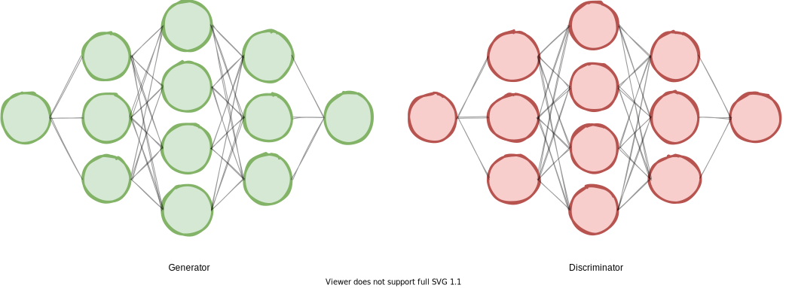

#### Back propagating neural network impressions

<!--  -->

<!-- Load TensorFlow.js. This is required to use MobileNet. -->

<!-- ## GAN in a single dimension

 -->

<!-- ## Mode collapse

test

  **Fig. 2:** 1D Mode collapse.

<video class="center-image" controls autoplay="autoplay" loop="">
  <source src="https://ichko.github.io/ml-playground/notebooks/distribs3.webm">
  Your browser does not support the video tag.
</video>

## Resources and Tools

- [Test](#) -->

